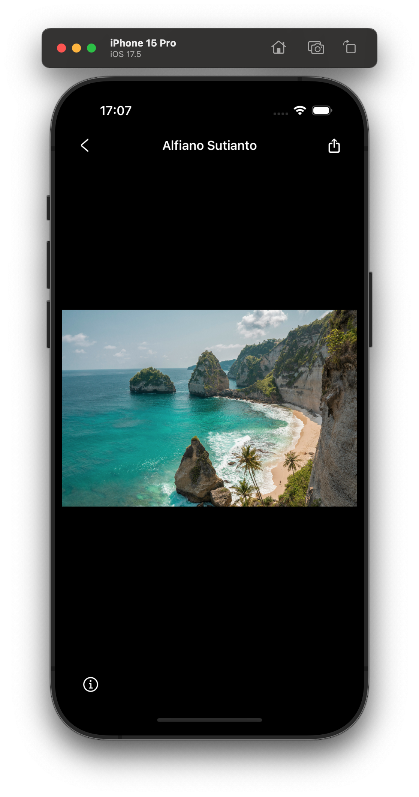

#  ImageQuest

ImageQuest  is an iOS application that leverages the powerful Unsplash API. It provides features such as browsing, searching for photos and their details, and sharing them, all while guaranteeing a pleasant user experience with its Unsplash-inspired UX/UI.


## Overview

<p align="center">


<br />



</p>

<br/>

## Table of Contents

<ol>
    <li><a href="#overview">Overview</a></li>
    <li><a href="#requirements">Requirements</a></li>
    <li><a href="#features">Features</a></li>
    <li><a href="#technologies-used">Technologies Used</a></li>
    <li>
      <a href="#getting-started">Getting Started</a>
      <ul>
        <li><a href="#prerequisites">Prerequisites</a></li>
        <li><a href="#installation">Installation</a></li>
      </ul>
    </li>
    <li><a href="#dependencies">Dependencies</a></li>
    <li><a href="#architecture">Architecture</a></li>
    <li><a href="#contact">Contact</a></li>
  </ol>

<br/>

## Requirements

* iOS 17.4+

## Features

- [x] Design inspired by the official Unsplash app.
- [x] Powered by [Unsplash API](https://unsplash.com/developers).
- [x] Gestures for photos, such as pinching, panning, and double tapping.
- [x] Utilizing MapKit to display the photo's location when it's available.

## Technologies Used

* Design Tools: Figma.
* UX/UI: SwiftUI.
* Asynchronous Operations: Concurrency and a touch of Combine.
* Third-party API Integration: [Unsplash API](https://unsplash.com/developers).

## Getting Started

This application uses [SPM](https://developer.apple.com/documentation/xcode/adding-package-dependencies-to-your-app) to manage dependencies.

## Prerequisites
1. Visit [Unsplash](https://unsplash.com), sign up then sign in.
2. Visit [Unsplash Application Registration Platform](https://unsplash.com/oauth/applications/new) agree with terms and create a new application.
3. After creating the application, you will be redirected to its details page. In the `Redirect URI & Permissions - Redirect URI` section, you can leave the default option, `Public access`, checked.

## Installation
1. Open the project and create a new file named `Config.json`. 
2. Input your "Access Key" in the following format:
``` json
{
  "client_id": "YOUR_ACCESS_KEY"
}
```

## Dependencies
This application uses the following packages (SPM):
* [SwiftUI CachedAsyncImage](https://github.com/lorenzofiamingo/swiftui-cached-async-image)
* [LazyCollectionView](https://github.com/unsplash/swiftui-lazycollectionview)

## Architecture
This project relies on Clean Architecture combined with MVVM-C (Model-View-ViewModel-Coordinator) design pattern.

<p align="center">

</p>

The structure of this project.
```
ImageQuest
├── Presentation # Views and View Models
│   ├── Navigation
│   ├── Screens
│   ├── Subviews
│   ├── Components
│   ├── Styles
│   └── Extensions
├── Domain
│   ├── Entities
│   ├── Interface
│   └── UseCases
├── Data
│   ├── Network
│   │   └── DataMapping
│   └── Repositories
└── Infrastructure
    └── Network
```

## Contact
For any queries or suggestions, feel free to contact me at [contact@sylvaindruaux.com](mailto:contact@sylvaindruaux.com).